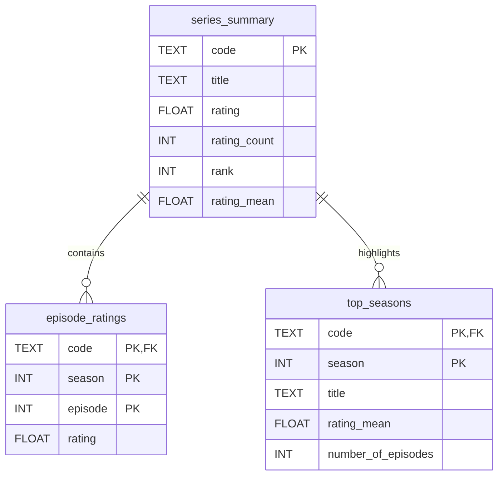
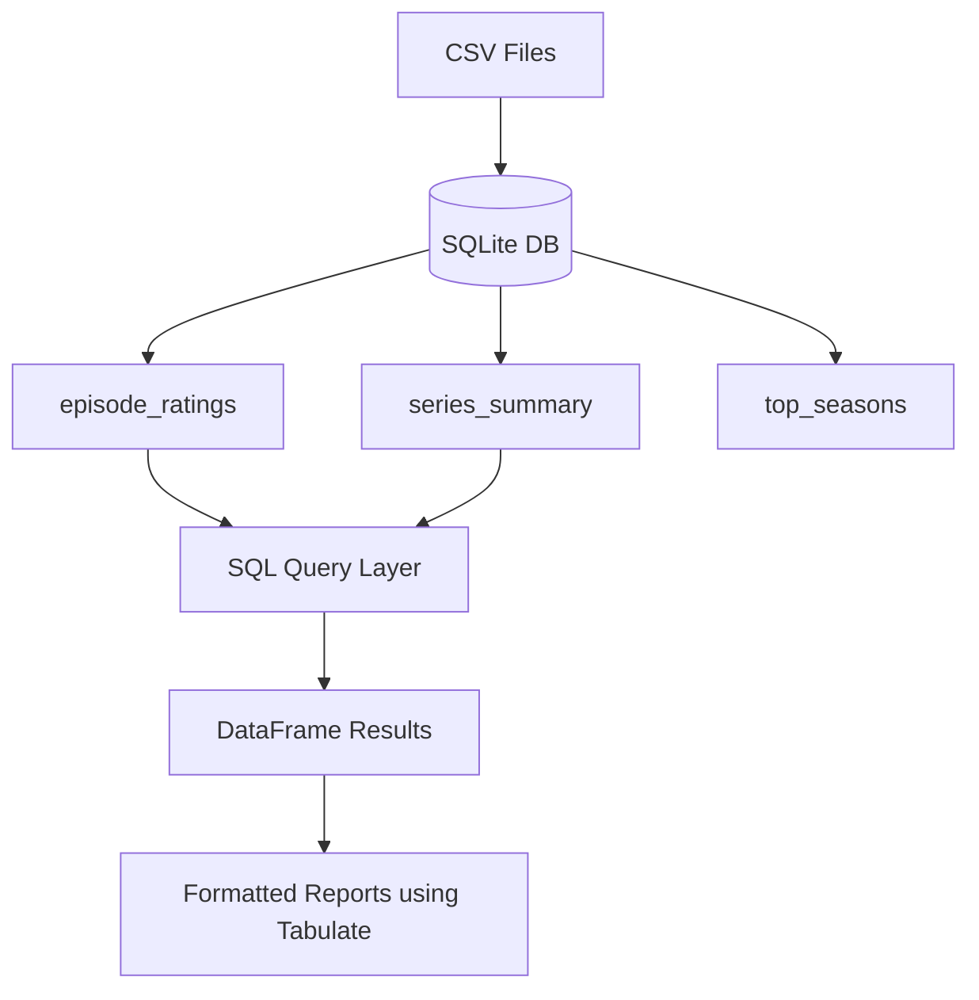

# Teleparty Data Engineering Challenge
This project solves a SQL-based data engineering challenge using Python and SQLite. It analyzes three datasets containing episode ratings, series summaries, and top-rated seasons. The goal is to ingest the data into a relational database, perform SQL queries, and generate clean reports.

---

##  Project Structure

```
  Teleparty-Project
├── all-episode-ratings.csv
├── all-series-ep-average.csv
├── top-seasons-full.csv
├── telepartyproj.py       # Main executable script
├── README.md              # This file
```

---

##  Table Schema (DDL)

```sql
-- series_summary
CREATE TABLE series_summary (
  code TEXT PRIMARY KEY,
  title TEXT,
  rating FLOAT,
  rating_count INTEGER,
  rank INTEGER,
  rating_mean FLOAT
);

-- episode_ratings
CREATE TABLE episode_ratings (
  code TEXT,
  season INTEGER,
  episode INTEGER,
  rating FLOAT,
  PRIMARY KEY (code, season, episode),
  FOREIGN KEY (code) REFERENCES series_summary(code)
);

-- top_seasons
CREATE TABLE top_seasons (
  code TEXT,
  season INTEGER,
  title TEXT,
  rating_mean FLOAT,
  number_of_episodes INTEGER,
  PRIMARY KEY (code, season),
  FOREIGN KEY (code) REFERENCES series_summary(code)
);
```
##  Tools Used
```
- Python 3
- SQLite3 (in-memory DB)
- Pandas
- Tabulate (for terminal output)
- Mermaid.js (for diagrams)

---
```
##  Data Ingestion
```
All 3 CSV files are loaded into in-memory SQLite tables:

- `episode_ratings`
- `series_summary`
- `top_seasons`

These tables are used for running real SQL queries.
```
---

## ⚙️ Queries Answered
```
###  Query 1: Display all shows with rating ≤ 5
- Option 1: Episode-based (any episode ≤ 5)
- Option 2: Series-based (overall rating ≤ 5)
- Option 3: Average rating (rating_mean ≤ 5)
- Subquery: Shows from each option with > 1 season

### Query 2: Show with highest rating count AND lowest rank

Displays show with both conditions met

Shows total episodes & seasons from episode_ratings

### Query 3: Show with lowest rating count AND highest rank

Displays show with both conditions met

Shows total episodes & seasons from episode_ratings


```
---

## 🔍 Example Output (Terminal)

```📊 1️⃣ OPTION 1: Shows with ANY episode rated ≤ 5
╒════╤═══════════╤════════════════════╤════════╤══════════╤═════════╕
│ No │ code      │ title              │ season │ episode  │ rating  │
╞════╪═══════════╪════════════════════╪════════╪══════════╪═════════╡
│  1 │ tt1234567 │ Dexter             │  2     │    4     │  4.8    │
│  2 │ tt2345678 │ Top Gear           │ 23     │    6     │  2.2    │
╘════╧═══════════╧════════════════════╧════════╧══════════╧═════════╛
```

##  Relational Schema (Mermaid Diagram)


---

##  System Architecture (Mermaid Diagram)



---

##  How to Run

```bash
pip install pandas tabulate
python3 telepartyproj.py
```

---

##  Author
Sreethi Reddy

---
